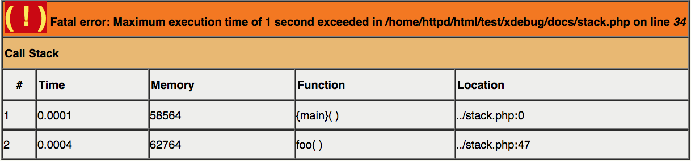
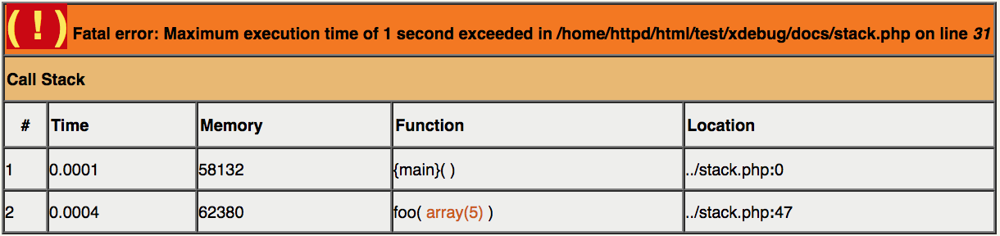
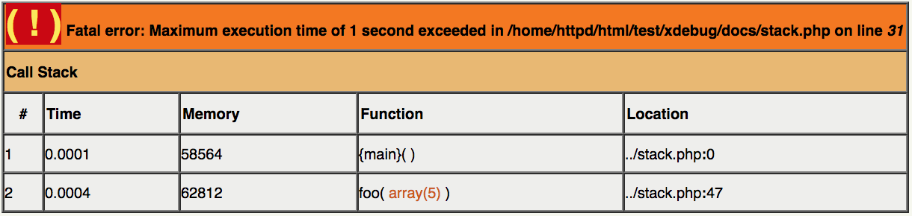
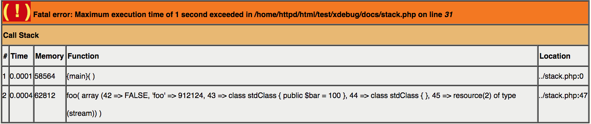
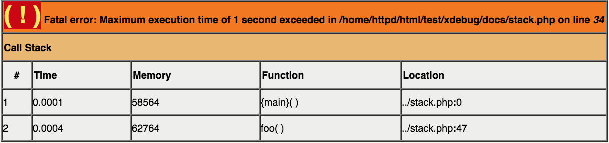
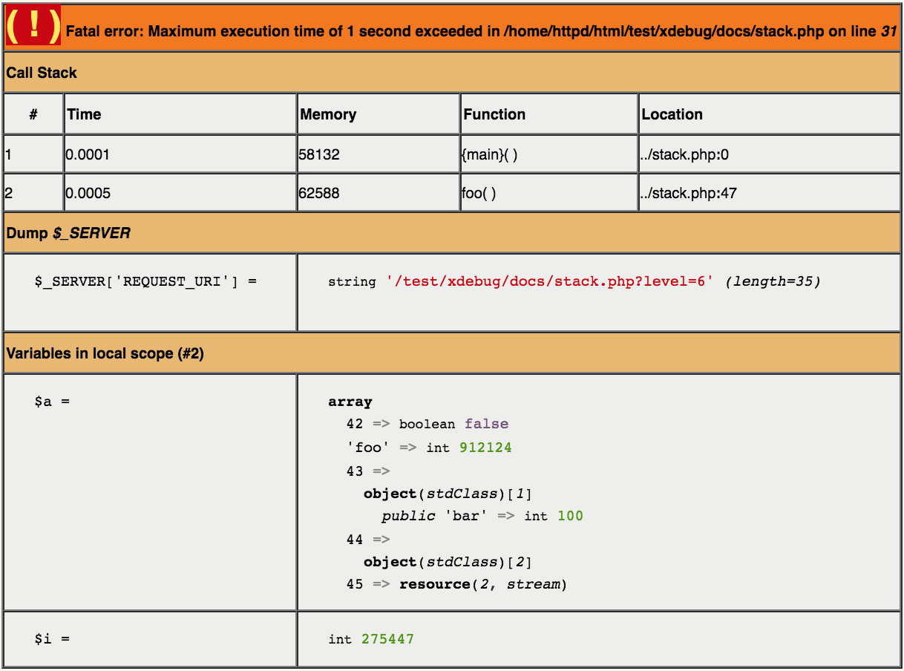
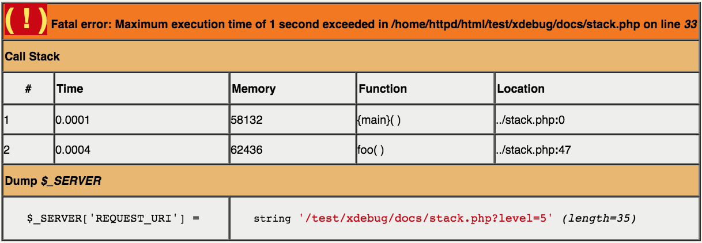
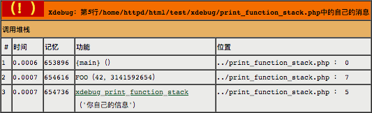

# 堆栈跟踪

当Xdebug被激活时，只要PHP决定显示通知，警告，错误等，就会显示堆栈跟踪。堆栈跟踪显示的信息以及显示方式可以根据您的需要进行配置。

Xdebug在错误情况下显示的堆栈跟踪信息量相当保守（如果[display.errors](http://www.php.net/manual/en/ref.errorfunc.php#ini.display-errors) 在php.ini中设置为On）。这是因为大量的信息会减慢脚本的执行速度和浏览器中堆栈跟踪本身的渲染速度。但是，可以使堆栈轨迹以不同的设置显示更详细的信息。

## 堆栈跟踪中的变量

默认情况下，Xdebug将在它生成的堆栈跟踪中显示可变信息。在收集或显示时，可变信息可能需要相当多的资源。但是，在很多情况下，显示变量信息是很有用的，这就是Xdebug具有设置 `xdebug.collect_params`的原因。下面的脚本与下面的示例中显示的输出结果与此设置的不同值相结合。

**Example:**

```php
<?php
function foo( $a ) {
    for ($i = 1; $i < $a['foo']; $i++) {
        if ($i == 500000) xdebug_break();
    }
}

set_time_limit(1);
$c = new stdClass;
$c->bar = 100;
$a = array(
    42 => false, 'foo' => 912124,
    $c, new stdClass, fopen( '/etc/passwd', 'r' )
);
foo( $a );
?>
```

**Result:**

`xdebug.collect_params`设置的 不同值给出了不同的输出，您可以在下面看到：

>  xdebug.collect_params：默认值



>  xdebug.collect_params：1



>  xdebug.collect_params：2



>  xdebug.collect_params：3



>  xdebug.collect_params：4


## 附加信息

除了显示传递给每个函数的变量的值之外，Xdebug还可以使用[xdebug.dump_globals](https://xdebug.org/docs/all_settings#dump_globals)和[xdebug.dump.*](https://xdebug.org/docs/all_settings#dump.*)设置选择性地显示有关所选[超级](https://xdebug.org/docs/all_settings#dump_globals)全局变量的信息。设置[xdebug.dump_once](https://xdebug.org/docs/all_settings#dump_once) 和[xdebug.dump_undefined](https://xdebug.org/docs/all_settings#dump_undefined)会稍微修改何时以及从可用的[超级](https://xdebug.org/docs/all_settings#dump_undefined)全局列表中显示哪些信息。通过[xdebug.show_local_vars](https://xdebug.org/docs/all_settings#show_local_vars)设置，您可以指示Xdebug显示用户定义函数的最顶层堆栈中的所有可用变量。下面的例子显示了这个（脚本是从上面的例子中使用的）。

**默认**



```php
ini_set('xdebug.collect_vars', 'on');
ini_set('xdebug.collect_params', '4');
ini_set('xdebug.dump_globals', 'on');
ini_set('xdebug.dump.SERVER', 'REQUEST_URI');
ini_set('xdebug.show_local_vars', 'on');
```



**dump_superglobals=1**

```php
ini_set('xdebug.collect_vars', 'on');
ini_set('xdebug.collect_params', '4');
ini_set('xdebug.dump_globals', 'on');
ini_set('xdebug.dump.SERVER', 'REQUEST_URI');
```



```php
ini_set('xdebug.collect_vars', 'on');
ini_set('xdebug.collect_params', '4');
ini_set('xdebug.dump_globals', 'on');
ini_set('xdebug.dump.SERVER', 'REQUEST_URI');
ini_set('xdebug.show_local_vars', 'on');
```


**show_local_vars=1**

```php
ini_set('xdebug.collect_vars', 'on');
ini_set('xdebug.collect_params', '4');
ini_set('xdebug.dump_globals', 'on');
ini_set('xdebug.dump.SERVER', 'REQUEST_URI');
ini_set('xdebug.show_local_vars', 'on');
```


## 过滤

Xdebug 2.6引入了堆栈跟踪的过滤功能。过滤器包括通过白名单，或通过黑名单，路径或类名前缀排除。您可以使用过滤器来防止供应商目录中的任何内容出现在堆栈跟踪中，或仅包含来自特定名称空间的类。

要设置一个过滤器，只显示没有类名的函数和方法，或者以“Xdebug”为前缀，可以调用[xdebug_set_filter()](https://xdebug.org/docs/all_functions#xdebug_set_filter) 

**Example:**

```php
xdebug_set_filter(
	XDEBUG_FILTER_TRACING,
	XDEBUG_NAMESPACE_WHITELIST,
	[ '', 'Xdebug' ]
);
```

使用这个过滤器设置，您将只能看到函数（没有类）和所有以“Xdebug”开头的类的方法调用。这包括内置的PHP函数（如`strlen()`）和调用 `XdebugTest::bar()`。过滤器不强制执行“Xdebug”是一个名称空间的名称，并且只从完全限定的类名称开始进行严格的字符比较。添加一个`\`前缀以确保只包含`Xdebug\`名称空间中的类。

有关[xdebug_set_filter()](https://xdebug.org/docs/all_functions#xdebug_set_filter) 参数的完整文档将在其自己的文档页面上进行介绍。

## 相关设置

#### xdebug.cli_color

> 该功能仅适用于`Xdebug> = 2.2`

类型：整数，默认值：0

设置为`1`时，在CLI模式下以及输出为tty时，Xdebug将**着色**var_dumps和堆栈跟踪输出。在Windows上， 需要安装[ANSICON](http://adoxa.110mb.com/ansicon/)工具。

设置为`2`时，那么无论是否连接到tty或是否安装ANSICON，Xdebug将始终为var_dumps和堆栈跟踪着色。在这种情况下，您最终可能会看到转义码。

有关更多信息，请参阅[这篇文章](http://drck.me/clicolor-9cr)。

#### xdebug.collect_includes

类型：布尔值，默认值：1

该设置控制着Xdebug是否应该将`include()`，`include_once()`，`require()`或`require_once()`中使用的文件名写入堆栈跟踪文件。

#### xdebug.collect_params

类型：整数，默认值：0

该设置控制Xdebug是否应该在功能跟踪或堆栈跟踪中记录一个函数调用时传递给函数的参数。

该设置默认为0，因为对于非常大的脚本，它可能会使用大量的内存，因此默认不开启该功能。您可以打开这个设置，大部分情况下这个设置是安全的，如果您的脚本有非常多的函数调用/巨大数据结构时，您可能会遇到一些为题。从`Xdebug2`开始不再有内存使用的问题，因为它不会将这些信息存储在内存中。而是写入磁盘。这意味着您需要看看磁盘使用情况。

该设置可以有四个不同的值。对于每个值，显示不同的信息量。下面您会看到每个值提供的信息。有关一些屏幕截图，另请参阅[Stack Traces](https://xdebug.org/docs/stack_trace)功能的介绍 。

| 值    | 显示的参数信息                                  |
| ---- | ---------------------------------------- |
| 0    | 不显示                                      |
| 1    | 元素的类型和数量（f.e. string(6), array(8)）       |
| 2    | 元素的类型和数量，以及提供完整信息的工具提示（ 在CLI版本的PHP中，它不会有工具提示，也不会在输出文件中。） |
| 3    | 完整的变量内容（限制取决于 [xdebug.var_display_max_children](https://xdebug.org/docs/all_settings#var_display_max_children), [xdebug.var_display_max_data](https://xdebug.org/docs/all_settings#var_display_max_data) 和 [xdebug.var_display_max_depth](https://xdebug.org/docs/all_settings#var_display_max_depth)） |
| 4    | 全变量内容和变量名称。                              |
| 5    | PHP序列化的变量内容，没有名字。*（Xdebug 2.3中的新功能）*     |

#### xdebug.collect_vars

类型：布尔值，默认值：0

这个设置告诉Xdebug收集关于在一定范围内使用哪些变量的信息。Xdebug必须对PHP的操作码数组进行逆向工程，因此这种分析可能会非常缓慢。这个设置不会记录不同的变量有哪些值，要是使用该功能请使用[xdebug.collect_params](https://xdebug.org/docs/all_settings#collect_params)。请在只有当您想使用[xdebug_get_declared_vars()](https://xdebug.org/docs/all_functions#xdebug_get_declared_vars)时才需要启用此设置 。

#### xdebug.dump.*

类型：字符串，默认值：空

`*`可以是任何`COOKIE`、 `FILES`、 `GET`、 `POST`、`REQUEST`、`SERVER`, `SESSION`。这七种设置控制发生错误时超级全局变量数据显示。

该选项的设置由一个逗号分隔的变量列表组成，这个变量从这个超级全局到转储，或者`*`所有这些变量。确保您不要在此设置中添加空格。

例如，在发生错误时转储`REMOTE_ADDR`和`REQUEST_METHOD`以及所有`GET`参数，请添加以下设置：

```ini
xdebug.dump.SERVER = REMOTE_ADDR，REQUEST_METHOD
xdebug.dump.GET = *
```

#### xdebug.dump_globals

类型：布尔值，默认值：1

当此设置设置为时`true`，Xdebug将通过[xdebug.dump.*](https://xdebug.org/docs/all_settings#dump.*)配置的超级全局值添加到屏幕上的堆栈跟踪和错误日志（如果启用）。

#### xdebug.dump_once

类型：布尔值，默认值：1

控制是否应在所有错误情况（设置为0）或仅在第一个（设置为1）时抛出超全局值的值。

#### xdebug.dump_undefined

类型：布尔值，默认值：0

如果要从超级全局变量中取出未定义的值，应将此设置设置为1，否则将其设置为0。

#### xdebug.file_link_format

> 该功能仅适用于`Xdebug> = 2.1`

类型：字符串，默认值：空

此设置确定使用文件名的堆栈跟踪显示中所建立的链接的格式。这允许IDE建立一个链接协议，通过点击Xdebug在堆栈跟踪中显示的文件名，可以直接进入一个行和文件。示例格式可能如下所示：

```
myide：//％F @％L
```

可能的格式说明符是：

| 符    | 含义   |
| ---- | ---- |
| ％F   | 文件名  |
| ％L   | 行号   |

对于各种IDE / OSses，列出了如何完成这项工作的一些说明：

#### Linux上的Firefox

- 打开[about:config](about:config)

- 添加一个新的布尔设置`network.protocol-handler.expose.xdebug`并将其设置为`false`

- 将以下内容添加到shell脚本中`~/bin/ff-xdebug.sh`

  ```
  #! /bin/sh

  f=`echo $1 | cut -d @ -f 1 | sed 's/xdebug:\/\///'`
  l=`echo $1 | cut -d @ -f 2`
  ```

  添加到（取决于你是否有komodo，gvim或netbeans）：

  - `komodo $f -l $l`
  - `gvim --remote-tab +$l $f`
  - `netbeans "$f:$l"`

- 使脚本可执行 `chmod +x ~/bin/ff-xdebug.sh`

- 将[xdebug.file_link_format](https://xdebug.org/docs/all_settings#file_link_format)设置为`xdebug://%f@%l`

#### Windows和netbeans

- 创建文件`netbeans.bat`

  并将其保存在路径中（C:\Windows将工作）：

  ```
  @echo off
  setlocal enableextensions enabledelayedexpansion
  set NETBEANS=%1
  set FILE=%~2
  %NETBEANS% --nosplash --console suppress --open "%FILE:~19%"
  nircmd win activate process netbeans.exe
  ```

  **注意：**如果没有，**请**删除最后一行`nircmd`。

- 将以下代码保存为`netbeans_protocol.reg`：

  ```
  Windows Registry Editor Version 5.00

  [HKEY_CLASSES_ROOT\netbeans]
  "URL Protocol"=""
  @="URL:Netbeans Protocol"

  [HKEY_CLASSES_ROOT\netbeans\DefaultIcon]
  @="\"C:\\Program Files\\NetBeans 7.1.1\\bin\\netbeans.exe,1\""

  [HKEY_CLASSES_ROOT\netbeans\shell]

  [HKEY_CLASSES_ROOT\netbeans\shell\open]

  [HKEY_CLASSES_ROOT\netbeans\shell\open\command]
  @="\"C:\\Windows\\netbeans.bat\" \"C:\\Program Files\\NetBeans 7.1.1\\bin\\netbeans.exe\" \"%1\""
  ```

  **注意：**确保将路径更改为Netbeans（两次），以及`netbeans.bat`批处理文件（如果将其保存在其他位置）`C:\Windows\`。

- 双击该`netbeans_protocol.reg`文件将其导入到注册表中。

- 将[xdebug.file_link_format](https://xdebug.org/docs/all_settings#file_link_format)设置为`xdebug.file_link_format = "netbeans://open/?f=%f:%l"`

#### xdebug.filename_format

> 该功能仅适用于`Xdebug> = 2.6`

类型：字符串，默认值：...%s%n

此设置确定Xdebug在HTML堆栈跟踪（默认[：）中](https://xdebug.org/docs/all_functions#xdebug_var_dump)`...%s%n`通过重载的[xdebug_var_dump（）](https://xdebug.org/docs/all_functions#xdebug_var_dump)（默认值 [：）](https://xdebug.org/docs/all_functions#xdebug_var_dump)呈现文件名的格式和位置信息`%f`。

此表中列出了可能的格式说明符。示例输出根据完整路径呈现 `/var/www/vendor/mail/transport/mta.php`。

| 符    | 含义                  | 示例输出                                     |
| ---- | ------------------- | ---------------------------------------- |
| %a   | Ancester：两个目录元素和文件名 | `mail/transport/mta.php`                 |
| %f   | 完整路径                | `/var/www/vendor/mail/transport/mta.php` |
| %n   | 名称：只有文件名            | `mta.php`                                |
| %p   | 父项：一个目录元素和文件名       | `transport/mta.php`                      |
| %s   | 目录分隔符               | `\`在Linux，OSX和其他类Unix系统`/`上              |

#### xdebug.manual_url

类型：字符串，默认值：http : //www.php.net

这是从函数跟踪和错误消息到消息中函数的手册页的链接的基础URL。建议将此设置设置为使用最近的镜像。、

#### xdebug.show_error_trace

> 该功能仅适用于`Xdebug> = 2.4`

类型：整数，默认值：0

当这个设置被设置为1时，只要发生错误，Xdebug将显示一个堆栈跟踪 - 即使这个错误实际上被捕获了。

#### xdebug.show_exception_trace

类型：整数，默认值：0

当这个设置被设置为1时，无论何时发生异常或错误，Xdebug都会显示一个堆栈跟踪 - 即使这个异常或错误实际上被捕获了。

异常 'exceptions' 是在PHP 7中引入的。

#### xdebug.show_local_vars

类型：整数，默认值：0

当这个设置被设置为`!= 0`时，Xdebug在错误情况下生成的堆栈转储也将显示最顶级作用域中的所有变量。注意，这可能会产生大量的信息，因此默认关闭。

#### xdebug.show_mem_delta

类型：整数，默认值：0

当这个设置被设置为`!= 0`时，Xdebug的可读生成的跟踪文件将显示函数调用之间的内存使用情况的差异。如果Xdebug被配置为生成计算机可读的跟踪文件，那么他们将始终显示此信息。

#### xdebug.var_display_max_children

类型：整数，默认值：128

当使用[xdebug_var_dump()](https://xdebug.org/docs/all_functions#xdebug_var_dump), [xdebug.show_local_vars](https://xdebug.org/docs/all_settings#show_local_vars)或通过[Function Traces](https://xdebug.org/docs/execution_trace)显示变量时，控制数组的子项和对象的属性的数量。

要禁用任何限制，请使用*-1*作为值。

此设置对通过[远程调试](https://xdebug.org/docs/remote)功能发送给客户端的子项数量没有任何影响。

#### xdebug.var_display_max_data

类型：整数，默认值：512

控制使用[xdebug_var_dump()](https://xdebug.org/docs/all_functions#xdebug_var_dump),[xdebug.show_local_vars](https://xdebug.org/docs/all_settings#show_local_vars)或通过[Function Traces](https://xdebug.org/docs/execution_trace)显示变量时显示的最大字符串长度。

要禁用任何限制，请使用*-1*作为值。

此设置对通过[远程调试](https://xdebug.org/docs/remote)功能发送给客户端的子项数量没有任何影响。

#### xdebug.var_display_max_depth

类型：整数，默认值：3

通过 [xdebug_var_dump()](https://xdebug.org/docs/all_functions#xdebug_var_dump), [xdebug.show_local_vars](https://xdebug.org/docs/all_settings#show_local_vars) 或[Function Traces](https://xdebug.org/docs/execution_trace)显示变量时，控制数组元素和对象属性的嵌套级别。

您可以选择的最大值是1023.您也可以使用*-1*作为值来选择此最大值。

此设置对通过[远程调试](https://xdebug.org/docs/remote)功能发送给客户端的子项数量没有任何影响。

## 相关功能

####  array xdebug_get_declared_vars()

返回一个数组，其中每个元素是在当前作用域中定义的变量名称。需要启用设置[xdebug.collect_vars](https://xdebug.org/docs/all_settings#collect_vars)。

**Example**

```php
<?php
    class strings {
        static function fix_strings($a, $b) {
            foreach ($b as $item) {
            }
            var_dump(xdebug_get_declared_vars());
        }
    }
    strings::fix_strings(array(1,2,3), array(4,5,6));
```

**Result**

```
array
  0 => string 'a' (length=1)
  1 => string 'b' (length=1)
  2 => string 'item' (length=4)
```

在5.1之前的PHP版本中，变量名称“a”不在返回的数组中，因为它未在调用函数`xdebug_get_declared_vars()`的作用域中使用。

#### array xdebug_get_function_stack()

返回关于堆栈的信息

**Example**

```php
<?php
    class strings {
        function fix_string($a)
        {
            var_dump(xdebug_get_function_stack());
        }

        function fix_strings($b) {
            foreach ($b as $item) {
                $this->fix_string($item);
            }
        }
    }

    $s = new strings();
    $ret = $s->fix_strings(array('Derick'));
```

**Result**

```
array
  0 => 
    array
      'function' => string '{main}' (length=6)
      'file' => string '/var/www/xdebug_get_function_stack.php' (length=63)
      'line' => int 0
      'params' => 
        array
          empty
  1 => 
    array
      'function' => string 'fix_strings' (length=11)
      'class' => string 'strings' (length=7)
      'file' => string '/var/www/xdebug_get_function_stack.php' (length=63)
      'line' => int 18
      'params' => 
        array
          'b' => string 'array (0 => 'Derick')' (length=21)
  2 => 
    array
      'function' => string 'fix_string' (length=10)
      'class' => string 'strings' (length=7)
      'file' => string '/var/www/xdebug_get_function_stack.php' (length=63)
      'line' => int 12
      'params' => 
        array
          'a' => string ''Derick'' (length=8)
```

#### array xdebug_get_monitored_functions()

> 该功能仅适用于`Xdebug> = 2.4`

返回有关监视功能的信息，其中包含有关在脚本中执行受监视函数的位置的信息。

**Example**

```php
<?php
/* Start the function monitor for strrev and array_push: */
xdebug_start_function_monitor( [ 'strrev', 'array_push' ] );

/* Run some code: */
echo strrev("yes!"), "\n";

echo strrev("yes!"), "\n";

var_dump(xdebug_get_monitored_functions());
xdebug_stop_function_monitor();
```

**Result**

```
/tmp/monitor-example.php:10:
array(2) {
  [0] =>
  array(3) {
    'function' =>
    string(6) "strrev"
    'filename' =>
    string(24) "/tmp/monitor-example.php"
    'lineno' =>
    int(6)
  }
  [1] =>
  array(3) {
    'function' =>
    string(6) "strrev"
    'filename' =>
    string(24) "/tmp/monitor-example.php"
    'lineno' =>
    int(8)
  }
}
```

#### integer xdebug_get_stack_depth()

返回当前的堆栈深度级别。脚本的主体是0级，每个函数调用都会将堆栈深度级别加1。

#### none xdebug_print_function_stack( [ string message [, int options ] ] )

> 该功能仅适用于`Xdebug> = 2.1`

以类似于Xdebug在错误情况下显示的方式显示当前函数堆栈。`“message”`参数允许您用自己的头替换标头中的消息。

**Example**

```php
<?php
function foo( $far, $out )
{
    xdebug_print_function_stack( 'Your own message' );
}
foo( 42, 3141592654 );
```

**Result**



位掩码`“options”`允许您配置一些额外的选项。目前支持以下选项：

* XDEBUG_STACK_NO_DESC

  如果设置了此选项，则打印的堆栈跟踪将不会有标题。如果您想从自己的错误处理程序打印堆栈跟踪，这很有用，否则打印的位置就是`xdebug_print_function_stack()`处信息。*（在Xdebug 2.3中引入）。*

#### void xdebug_start_function_monitor( array $list_of_functions_to_monitor )

> 该功能仅适用于`Xdebug> = 2.4`

开始功能监控。该函数启动对列表中给出的函数的监视作为该函数的参数。通过函数监视，您可以查找代码中的哪个位置作为参数提供的函数。

**Example**

```php
<?php
xdebug_start_function_monitor( [ 'strrev', 'array_push' ] );
```

您还可以将类方法和静态方法添加到定义要监视哪些函数的数组中。例如，要捕获对`DramModel::canSee`的静态调用和对`Whisky-> drink`的动态调用，可以使用以下命令启动监视器：

**Example**

```php
<?php
xdebug_start_function_monitor( [ 'DramModel::canSee', 'Whisky->drink'] );
```

定义的函数区分大小写，并且不会捕获对静态方法的动态调用。

#### void xdebug_stop_function_monitor()

> 该功能仅适用于`Xdebug> = 2.4`

停止监视功能。为了获得被监视函数的列表，你需要使用[xdebug_get_monitored_functions()](https://xdebug.org/docs/all_functions#xdebug_get_monitored_functions) 函数。